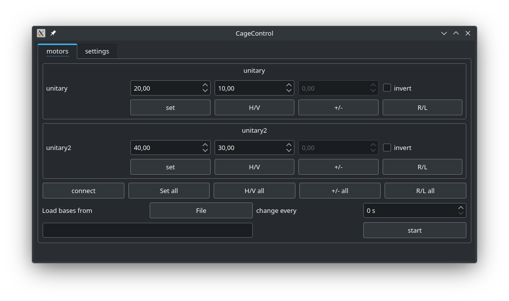
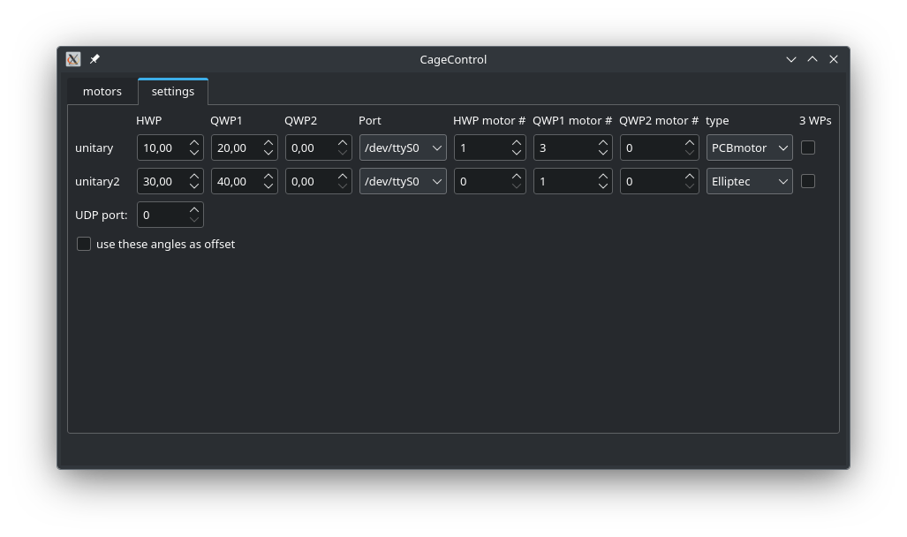

# cagecontrol
Graphical user interface to control PCBMotor and Thorlabs Elliptec based polarization tomography stages.

# what it does


Provides a GUI to rotate polarization tomography stages to certain bases (linear, diagonal, circular).
Or to any arbitrary angle.

# how to build
```
git submodule update --init --recursive  
mkdir build  
cd build  
qmake ..  
make  
```


# how to add your waveplate details
On the first run, a configuration file will be created (cagecontrol.conf). In the "[General]" section, you'll find the values  
```
[General]
NumUnitaries=1  
UnitaryName0=unitary
```

adjust to your liking  
Then, in the settings tag in the GUI, you will need to adjust 


- the motor positions indicating the fast axis of your waveplates
- the serial port of the motor controller
- the motor id of the corresponding waveplates
- the type of controller you use (PCBMotor, Elliptec)

If you want to use it for a universal polarization gadget with 3 waveplates, check the "3 WPs" checkbox.


# Control it over the network
The program can be operated over the network using UDP.  
In the scripts folder, you'll find a python example.

# Intended use
A polarization tomography stage looking like

input -> QWP -> HWP -> PBS/Polarizer -> Output

E.G. pressing "H/V", the waveplates are rotated to transmit horizontally polarized light through the PBS.
By checking the "invert" box, they would be rotated to transmit vertically polarized light.

If you want to use a 3WP gadget, a QHQ configuration is assumed.
